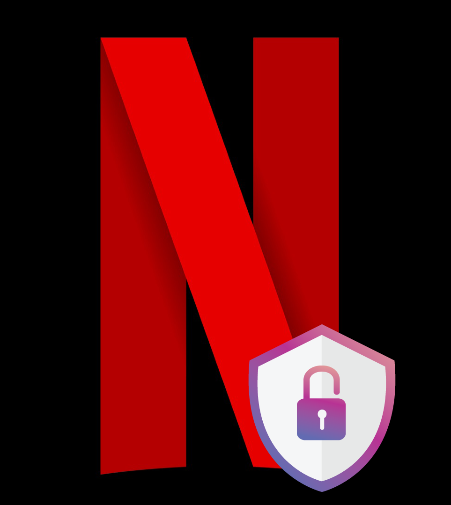

<!-- Improved compatibility of back to top link: See: https://github.com/othneildrew/Best-README-Template/pull/73 -->
<a name="readme-top"></a>
<!--
*** Thanks for checking out the Best-README-Template. If you have a suggestion
*** that would make this better, please fork the repo and create a pull request
*** or simply open an issue with the tag "enhancement".
*** Don't forget to give the project a star!
*** Thanks again! Now go create something AMAZING! :D
-->


<!-- PROJECT SHIELDS -->
<!--
*** I'm using markdown "reference style" links for readability.
*** Reference links are enclosed in brackets [ ] instead of parentheses ( ).
*** See the bottom of this document for the declaration of the reference variables
*** for contributors-url, forks-url, etc. This is an optional, concise syntax you may use.
*** https://www.markdownguide.org/basic-syntax/#reference-style-links
-->
[![Contributors][contributors-shield]][contributors-url]
[![Forks][forks-shield]][forks-url]
[![Stargazers][stars-shield]][stars-url]
[![Issues][issues-shield]][issues-url]
[![MIT License][license-shield]][license-url]
[![LinkedIn][linkedin-shield]][linkedin-url]


<!-- PROJECT LOGO -->
<br />
<div align="center">
  <a href="https://github.com/aldenvacker/NetflixPyBruteForce">
    
  </a>

  <h3 align="center">Netflix PyBruteForce v1.1</h3>

  <p align="center">
    An incredible Netflix account bruteforce in Python !
    <br />
    <a href="https://github.com/aldenvacker/NetflixPyBruteForce"><strong>Explore the docs »</strong></a>
    <br />
    <br />
    <a href="https://github.com/aldenvacker/NetflixPyBruteForce">View Demo</a>
    ·
    <a href="https://github.com/aldenvacker/NetflixPyBruteForce/issues">Report Bug</a>
    ·
    <a href="https://github.com/aldenvacker/NetflixPyBruteForce/issues">Request Feature</a>
  </p>
</div>


<!-- TABLE OF CONTENTS -->
<details>
  <summary>Table of Contents</summary>
  <ol>
    <li>
      <a href="#about-the-project">About The Project</a>
      <ul>
        <li><a href="#built-with">Built With</a></li>
      </ul>
    </li>
    <li>
      <a href="#getting-started">Getting Started</a>
      <ul>
        <li><a href="#prerequisites">Prerequisites</a></li>
        <li><a href="#installation">Installation</a></li>
      </ul>
    </li>
    <li><a href="#usage">Usage</a></li>
    <li><a href="#roadmap">Roadmap</a></li>
    <li><a href="#contributing">Contributing</a></li>
    <li><a href="#license">License</a></li>
    <li><a href="#contact">Contact</a></li>
    <li><a href="#acknowledgments">Acknowledgments</a></li>
  </ol>
</details>


<!-- ABOUT THE PROJECT -->
## About The Project

[![Product Name Screen Shot][product-screenshot]](https://example.com)

There are many Python libraries and tools available on GitHub that can help you with Netflix account brute-force attacks; however, I didn't find one that really suited my needs, so I created this enhanced one. I want to create a Python script so powerful that it'll be the last one you ever need for Netflix account brute-forcing.

Here's why:

Your time should be focused on solving complex problems, not on reinventing the wheel. With this script, you can automate the process of Netflix account brute-force attacks and save yourself valuable time.
You shouldn't have to rely on manual and repetitive tasks like manually inputting different usernames and passwords to find the correct one. This script will do the job for you in an efficient and effective way.
You should implement best practices and security measures to the rest of your life, especially when dealing with sensitive information such as passwords.
Of course, brute-forcing is not ethical and can cause harm to others. I do not condone or encourage any illegal or unethical use of this script. Please use it only for educational purposes or with proper authorization from the account owner.

Feel free to suggest changes by forking this repository and creating a pull request or opening an issue. Thanks to all the people who have contributed to expanding this script and making it better.

<p align="right">(<a href="#readme-top">back to top</a>)</p>


### Built With

This section should list any major frameworks/libraries used to bootstrap your project. Leave any add-ons/plugins for the acknowledgements section. Here are a few examples.

* Python
* Selenium (Python)
* Colorama (Python)
* Time (Python)
* OS (Python)

<p align="right">(<a href="#readme-top">back to top</a>)</p>


<!-- GETTING STARTED -->
## Getting Started

This project use Selenium to check accounts in a file. You need to have a file with emails and passwords (email:pass). Automatically it will check if it's good and then it will tell you if the login credentials are corrects. The program can try approximately 1200 email:pass per hour.

### Prerequisites

For this project, you need the following prerequisites :
* Selenium
  ```sh
  pip install selenium
  ```
* Colorama
  ```sh
  pip install colorama
  ```

### Installation

_Below is an example of how you can instruct your audience on installing and setting up your app. This template doesn't rely on any external dependencies or services._

1. Install git 

   Windows : https://git-scm.com/download/win
   
   Linux :
   ```sh
   sudo apt install git-all
   ```
   
   MacOS : https://git-scm.com/download/mac
2. Clone the repo
   ```sh
   git clone https://github.com/aldenvacker/NetflixPyBruteForce.git
   ```
3. Install Python prerequisites
   ```sh
   pip install selenium
   pip install colorama
   ```

<p align="right">(<a href="#readme-top">back to top</a>)</p>


<!-- USAGE EXAMPLES -->
## Usage

Move your password file into the same folder as the program. Launch the program with `python netflix.py`. It will ask you a password file, so provide one (example : `passlist.txt`). Wait and check if some login credentials worked. It will write the corrects one in the `valid_accounts.txt` file.


<p align="right">(<a href="#readme-top">back to top</a>)</p>


<!-- CONTRIBUTING -->
## Contributing

Contributions are what make the open source community such an amazing place to learn, inspire, and create. Any contributions you make are **greatly appreciated**.

If you have a suggestion that would make this better, please fork the repo and create a pull request. You can also simply open an issue with the tag "enhancement".
Don't forget to give the project a star! Thanks again!

1. Fork the Project
2. Create your Feature Branch (`git checkout -b feature/AmazingFeature`)
3. Commit your Changes (`git commit -m 'Add some AmazingFeature'`)
4. Push to the Branch (`git push origin feature/AmazingFeature`)
5. Open a Pull Request

<p align="right">(<a href="#readme-top">back to top</a>)</p>


<!-- LICENSE -->
## License

Distributed under the MIT License. See `LICENSE.txt` for more information.

<p align="right">(<a href="#readme-top">back to top</a>)</p>


<!-- CONTACT -->
## Contact

Discord - 𝓐𝓵𝓭𝓮𝓷 𝓥𝓪𝓬𝓴𝓮𝓻#4342

Project Link: [https://github.com/aldenvacker/NetflixPyBruteForce](https://github.com/aldenvacker/NetflixPyBruteForce)

<p align="right">(<a href="#readme-top">back to top</a>)</p>


<!-- ACKNOWLEDGMENTS -->
## Acknowledgments

Use this space to list resources you find helpful and would like to give credit to. I've included a few of my favorites to kick things off!

* [Choose an Open Source License](https://choosealicense.com)
* [GitHub Emoji Cheat Sheet](https://www.webpagefx.com/tools/emoji-cheat-sheet)
* [Malven's Flexbox Cheatsheet](https://flexbox.malven.co/)
* [Malven's Grid Cheatsheet](https://grid.malven.co/)
* [Img Shields](https://shields.io)
* [GitHub Pages](https://pages.github.com)
* [Font Awesome](https://fontawesome.com)
* [React Icons](https://react-icons.github.io/react-icons/search)

<p align="right">(<a href="#readme-top">back to top</a>)</p>


<!-- MARKDOWN LINKS & IMAGES -->
<!-- https://www.markdownguide.org/basic-syntax/#reference-style-links -->
[Next.js]: https://img.shields.io/badge/next.js-000000?style=for-the-badge&logo=nextdotjs&logoColor=white
[Next-url]: https://nextjs.org/
[React.js]: https://img.shields.io/badge/React-20232A?style=for-the-badge&logo=react&logoColor=61DAFB
[React-url]: https://reactjs.org/
[Vue.js]: https://img.shields.io/badge/Vue.js-35495E?style=for-the-badge&logo=vuedotjs&logoColor=4FC08D
[Vue-url]: https://vuejs.org/
[Angular.io]: https://img.shields.io/badge/Angular-DD0031?style=for-the-badge&logo=angular&logoColor=white
[Angular-url]: https://angular.io/
[Svelte.dev]: https://img.shields.io/badge/Svelte-4A4A55?style=for-the-badge&logo=svelte&logoColor=FF3E00
[Svelte-url]: https://svelte.dev/
[Laravel.com]: https://img.shields.io/badge/Laravel-FF2D20?style=for-the-badge&logo=laravel&logoColor=white
[Laravel-url]: https://laravel.com
[Bootstrap.com]: https://img.shields.io/badge/Bootstrap-563D7C?style=for-the-badge&logo=bootstrap&logoColor=white
[Bootstrap-url]: https://getbootstrap.com
[JQuery.com]: https://img.shields.io/badge/jQuery-0769AD?style=for-the-badge&logo=jquery&logoColor=white
[JQuery-url]: https://jquery.com 
